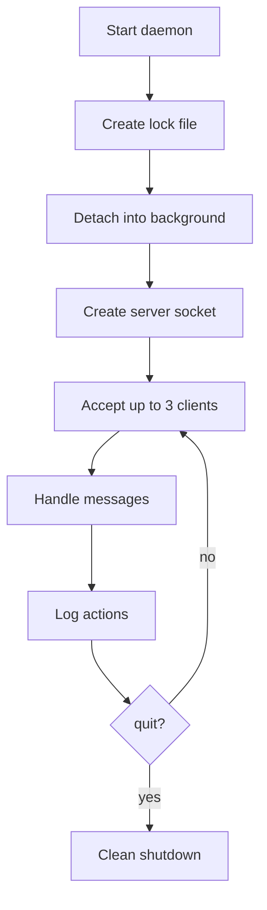

# 🧿 Matt_daemon — UNIX Daemon 

<p align="center">
  
</p>


---

## 📖 About

**Matt_daemon** is a fully‑featured UNIX daemon written in C++ for the 42 curriculum.

It runs in the background, listens on port **4242**, logs every action, handles signals, prevents multiple instances, and supports up to **3 simultaneous clients**.

You also implemented **all bonuses**, turning it into a real mini‑system service:

- 🔐 XOR encrypted client (Ben_AFK)
- 🐚 Remote shell
- 🗄️ Automatic log archival
- 🖥️ GUI client
- 🔑 Authentication system
- 🔒 Advanced encryption

---

## ✨ Features

### Mandatory

- 🧩 Daemon mode (fork, setsid, chdir, umask)
- 🔒 Single instance via `/var/lock/matt_daemon.lock`
- 📡 TCP server on port **4242**
- 🧵 Up to **3 clients** at the same time
- 📜 Tintin_reporter logging system
- 🛡️ Signal handling (SIGINT, SIGTERM, SIGHUP…)
- 📝 Logging of all user messages
- ❌ Clean shutdown via `quit`

### Bonus

- 🔐 XOR encryption (Ben_AFK client)
- 🐚 Remote shell
- 🗄️ Log archival system
- 🖥️ Graphical client
- 🔑 Authentication
- 🔒 Advanced crypto

---

## 🧠 How it works




## 🚀 Installation

### Requirements

- Linux
- C++ compiler
- Make
- root privileges (daemon + port binding)

### Build

```bash
make
```

Clean:

```bash
make clean
make fclean
make re
```

---

## 💻 Usage

Start the daemon:

```bash
sudo ./Matt_daemon
```

Connect with netcat:

```bash
nc localhost 4242
```

Send messages:

```
hello
test
quit
```

---

## 📜 Logging

Logs are stored in:

```
/var/log/matt_daemon/matt_daemon.log
```

Example:

```
[11/09/2026-10:15:15] [INFO] - Matt_daemon: Started.
[11/09/2026-10:15:15] [LOG]  - User input: hello
[11/09/2026-10:15:20] [INFO] - Request quit.
```

---

## 🛡️ Signal Handling

The daemon logs and exits cleanly on:

- SIGINT
- SIGTERM
- SIGHUP

Example:

```
[11/09/2026-10:15:24] [INFO] - Matt_daemon: Signal handler.
[11/09/2026-10:15:24] [INFO] - Matt_daemon: Quitting.
```

---

## 🔒 Lock File

Only one instance can run:

```
/var/lock/matt_daemon.lock
```

If a second instance is launched:

```
Can't open :/var/lock/matt_daemon.lock
```

---

## 🔐 Bonus: XOR Client (Ben_AFK)

Encrypted messages start with:

```
XOR:<encrypted_data>
```

The daemon decrypts automatically.

---

## 🐚 Bonus: Remote Shell

The client can open a remote shell session:

```
shell
ls -la
whoami
exit
```

---

## 🗄️ Bonus: Log Archival

Old logs are automatically moved to:

```
/var/log/matt_daemon/archive/
```

---

## 👤 Author

**tren-chvl**

